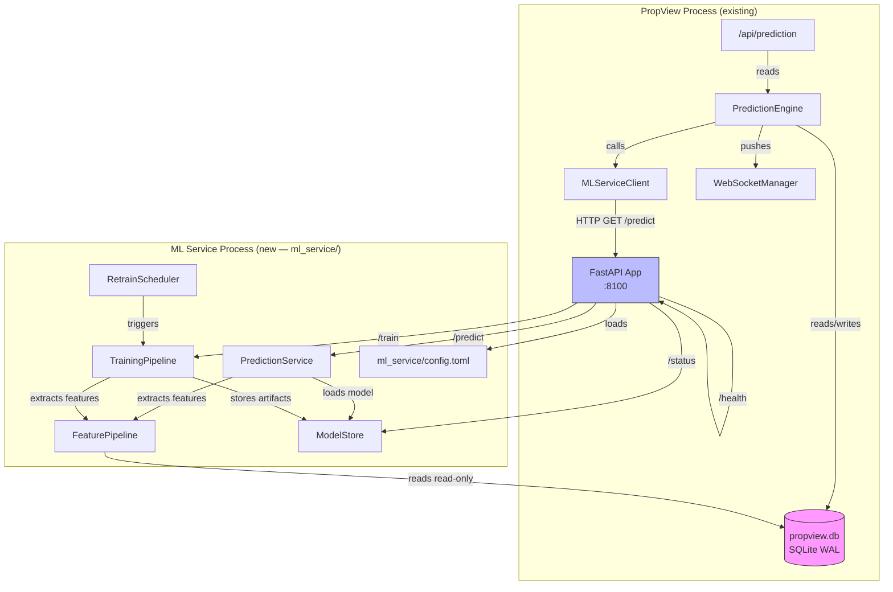
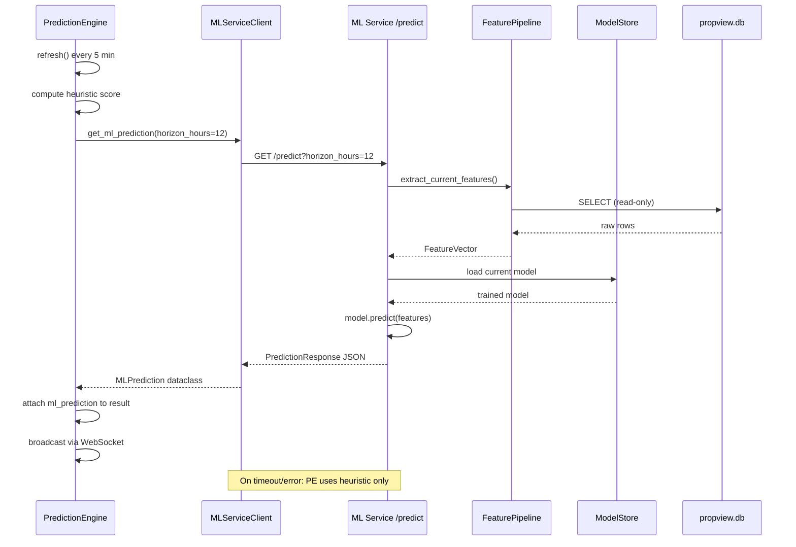
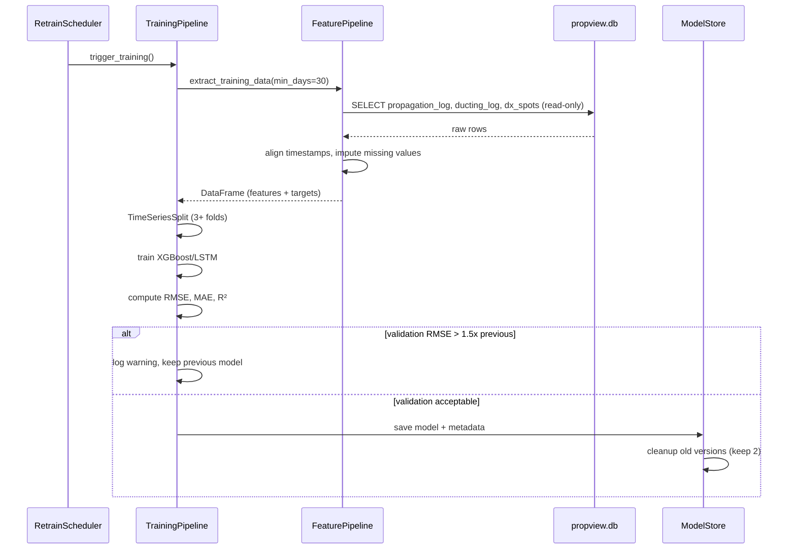

# Design Document: ML Propagation Service

## Overview

This feature adds a standalone ML-based propagation prediction service (`ml_service/`) that runs as an independent Python/FastAPI process alongside the existing APRS PropView application. The ML Service reads PropView's SQLite database in read-only mode, extracts time-aligned features from the `propagation_log`, `ducting_log`, `dx_spots`, and `stations` tables, trains XGBoost (default) or lightweight LSTM models, and exposes REST API endpoints (`/predict`, `/train`, `/status`, `/health`) for propagation score prediction (0–100) and opening probability over a 1–24 hour horizon. PropView's existing `PredictionEngine` integrates via a thin HTTP client (`MLServiceClient`), falling back gracefully to heuristic scoring when the ML Service is unavailable.

### Design Decisions

1. **Separate process, separate directory**: The ML Service lives in `ml_service/` with its own `requirements.txt`, `config.toml`, and entry point (`main.py`). It has zero import dependencies on PropView's `server/` package. This allows independent deployment, updates, and resource management — the ML training workload doesn't compete with PropView's real-time packet processing.

2. **Read-only database access**: The ML Service opens PropView's SQLite database with `?mode=ro` URI and `PRAGMA query_only = ON`. Combined with PropView's existing WAL mode, this allows concurrent reads without interfering with PropView's writes.

3. **XGBoost as default, LSTM as option**: XGBoost provides fast training, low memory usage, and strong tabular performance — ideal for the feature vector size (~13 features). LSTM is offered as a configurable alternative for operators who want to capture longer temporal dependencies, at the cost of PyTorch as a dependency.

4. **Time-based cross-validation**: Training uses `TimeSeriesSplit` (minimum 3 folds) to prevent future data leakage. This is critical for time-series prediction — random splits would produce misleadingly optimistic validation metrics.

5. **Model versioning with 2-version retention**: The Model Store keeps the two most recent model artifacts. This provides a rollback path without unbounded disk growth. Each model has a companion `model_metadata.json` with training metrics and feature names.

6. **Thin HTTP client in PropView**: The `MLServiceClient` added to `PredictionEngine` uses `httpx.AsyncClient` with a 2-second timeout. It makes a single non-retrying call per refresh cycle. On any failure (connection refused, timeout, HTTP error), the heuristic score is used as-is and the failure is logged at warning level.

7. **30-day minimum data threshold**: The ML Service requires 30 days of `propagation_log` data before producing predictions. Below this threshold, `/predict` returns `ready: false` with a message explaining the data shortfall. This prevents the model from training on insufficient data and producing unreliable predictions.

## Architecture



### Request Flow: Prediction Refresh Cycle



### Training Flow



## Components and Interfaces

### 1. ML Service Entry Point (`ml_service/main.py`)

The FastAPI application factory and uvicorn startup.

```python
from fastapi import FastAPI

def create_app(config: MLServiceConfig) -> FastAPI:
    """Create the ML Service FastAPI application."""
    ...

def main():
    """Load config, create app, run uvicorn."""
    ...

if __name__ == "__main__":
    main()
```

### 2. Configuration (`ml_service/config.py`)

```python
from dataclasses import dataclass, field
from pathlib import Path
from typing import Optional

@dataclass
class MLServiceConfig:
    host: str = "127.0.0.1"
    port: int = 8100
    propview_db_path: str = "../propview.db"
    model_type: str = "xgboost"          # "xgboost" or "lstm"
    retrain_schedule: str = "daily"      # "daily" or "weekly"
    model_store_path: str = "models/"
    min_data_days: int = 30
    log_level: str = "info"
    alignment_window_seconds: int = 300  # 5-minute timestamp alignment

    @staticmethod
    def load(path: Path) -> "MLServiceConfig":
        """Load from TOML file. Creates default if missing."""
        ...

    @staticmethod
    def create_default(path: Path) -> None:
        """Write a default config.toml."""
        ...

    def validate(self) -> list[str]:
        """Return list of validation error messages (empty = valid)."""
        ...
```

### 3. Feature Pipeline (`ml_service/feature_pipeline.py`)

Reads PropView's SQLite database and produces feature vectors.

```python
import sqlite3
import pandas as pd
from dataclasses import dataclass
from typing import Optional

@dataclass
class FeatureVector:
    """A single time-step's feature values for model input."""
    hour_of_day: int            # 0–23
    day_of_week: int            # 0–6 (Monday=0)
    month: int                  # 1–12
    ducting_index: float        # from ducting_log
    pressure_trend: float       # from ducting_log
    humidity: float             # from ducting_log
    temp_f: float               # from ducting_log (proxy for wind/temp)
    rf_station_count: int       # from propagation_log
    max_distance_km: float      # from propagation_log
    avg_distance_km: float      # from propagation_log
    unique_stations_1h: int     # from propagation_log
    dx_spot_rate_1h: float      # from dx_spots
    inversion_detected: int     # 0 or 1, from ducting_log

    def to_array(self) -> list[float]:
        """Convert to flat numeric array for model input."""
        ...

    @staticmethod
    def feature_names() -> list[str]:
        """Return ordered list of feature names."""
        ...

class FeaturePipeline:
    """Extracts and transforms features from PropView's SQLite database."""

    def __init__(self, db_path: str, alignment_window_seconds: int = 300):
        self._db_path = db_path
        self._alignment_window = alignment_window_seconds

    def _open_readonly(self) -> sqlite3.Connection:
        """Open the database in read-only mode with retry logic.

        Uses ?mode=ro URI and PRAGMA query_only = ON.
        Retries with exponential backoff (1s, 2s, 4s) on locked database,
        max 3 attempts.
        """
        ...

    def extract_training_data(
        self, min_days: int = 30
    ) -> Optional[pd.DataFrame]:
        """Extract time-aligned features and targets for training.

        Returns a DataFrame with feature columns and a 'target_score'
        column, or None if insufficient data.

        Joins propagation_log, ducting_log, and dx_spots using
        timestamp alignment within the configured window.
        Applies column-specific imputation:
          - median for atmospheric fields (ducting_index, pressure_trend, humidity, temp_f)
          - zero for count fields (rf_station_count, max_distance_km, avg_distance_km,
            unique_stations_1h, dx_spot_rate_1h, inversion_detected)
          - forward-fill for time-series fields
        Skips corrupt/unexpected rows with WARNING log, continues processing.
        """
        ...

    def extract_current_features(self) -> Optional[FeatureVector]:
        """Extract the most recent feature vector for prediction.

        Returns None if the database is inaccessible.
        """
        ...

    def get_data_coverage_days(self) -> int:
        """Return the number of days of data in propagation_log."""
        ...
```

### 4. Training Pipeline (`ml_service/training_pipeline.py`)

Orchestrates model training, validation, and artifact storage.

```python
from dataclasses import dataclass
from typing import Optional
import pandas as pd

@dataclass
class ValidationMetrics:
    rmse: float
    mae: float
    r_squared: float

@dataclass
class TrainingResult:
    success: bool
    metrics: Optional[ValidationMetrics]
    model_version: str
    data_rows: int
    data_date_range: tuple[str, str]  # (start_iso, end_iso)
    duration_seconds: float
    error_message: Optional[str] = None

class TrainingPipeline:
    """Trains and validates ML models for propagation prediction."""

    def __init__(
        self,
        feature_pipeline: FeaturePipeline,
        model_store: ModelStore,
        config: MLServiceConfig,
    ):
        ...

    async def train(self) -> TrainingResult:
        """Run a full training cycle: extract → split → train → validate → store.

        Executes in a thread pool to avoid blocking the event loop.
        Returns TrainingResult with metrics and status.

        If new model's RMSE > 1.5× previous model's RMSE, logs warning
        and retains the previous model.
        """
        ...

    def _train_xgboost(
        self, X_train: pd.DataFrame, y_train: pd.Series
    ) -> object:
        """Train an XGBoost regressor."""
        ...

    def _train_lstm(
        self, X_train: pd.DataFrame, y_train: pd.Series
    ) -> object:
        """Train a lightweight LSTM model via PyTorch."""
        ...

    def _validate(
        self,
        model: object,
        X_val: pd.DataFrame,
        y_val: pd.Series,
    ) -> ValidationMetrics:
        """Compute RMSE, MAE, R² on validation data."""
        ...

    def _time_series_split(
        self, df: pd.DataFrame, n_splits: int = 3
    ) -> list[tuple[pd.DataFrame, pd.DataFrame]]:
        """Time-based cross-validation splits (no future leakage).

        Uses sklearn TimeSeriesSplit. Ensures max(train_timestamps) <
        min(val_timestamps) for every fold.
        """
        ...
```

### 5. Model Store (`ml_service/model_store.py`)

Persists and loads model artifacts with versioning.

```python
from dataclasses import dataclass
from typing import Optional
from pathlib import Path

@dataclass
class ModelMetadata:
    version: str                    # e.g. "20250115_143022"
    model_type: str                 # "xgboost" or "lstm"
    training_timestamp: str         # ISO 8601
    data_date_range: tuple[str, str]
    data_row_count: int
    feature_names: list[str]
    metrics: ValidationMetrics
    file_path: str                  # relative path to artifact

class ModelStore:
    """Manages model artifact storage, loading, and version cleanup."""

    def __init__(self, store_path: str):
        self._path = Path(store_path)

    def save_model(
        self,
        model: object,
        metadata: ModelMetadata,
        model_type: str,
    ) -> str:
        """Persist model artifact and metadata. Returns version string.

        XGBoost models are saved via joblib.
        LSTM models are saved as PyTorch checkpoints.
        Writes model_metadata.json alongside the artifact.
        """
        ...

    def load_latest(self) -> Optional[tuple[object, ModelMetadata]]:
        """Load the most recent valid model and its metadata.

        Returns None if no model exists.
        """
        ...

    def cleanup(self, keep: int = 2) -> list[str]:
        """Delete all but the most recent `keep` model versions.

        Returns list of deleted version strings.
        """
        ...

    def get_metadata(self) -> Optional[ModelMetadata]:
        """Return metadata for the currently loaded model."""
        ...
```

### 6. Prediction Service (`ml_service/prediction_service.py`)

Handles prediction requests using the loaded model.

```python
from dataclasses import dataclass
from typing import Optional

@dataclass
class HourlyForecast:
    hours_ahead: int            # 1–24
    predicted_score: float      # 0–100
    opening_probability: float  # 0.0–1.0
    timestamp: str              # ISO 8601 UTC
    confidence: str             # "low", "medium", "high"

@dataclass
class PredictionResponse:
    ready: bool
    score: float                            # 0–100
    opening_probability: float              # 0.0–1.0
    confidence: str                         # "low", "medium", "high"
    model_version: str
    features_used: dict[str, float]
    forecast: list[HourlyForecast]
    message: Optional[str] = None           # status message when not ready

class PredictionService:
    """Generates predictions using the trained model."""

    def __init__(
        self,
        feature_pipeline: FeaturePipeline,
        model_store: ModelStore,
        config: MLServiceConfig,
    ):
        self._feature_pipeline = feature_pipeline
        self._model_store = model_store
        self._config = config
        self._cached_prediction: Optional[PredictionResponse] = None

    def predict(self, horizon_hours: int = 12) -> PredictionResponse:
        """Generate a prediction for the given horizon.

        Returns a PredictionResponse with ready=False if:
          - No trained model is available
          - Insufficient data (< min_data_days)
          - Database is inaccessible (returns cached if available)

        Clamps predicted score to [0, 100].
        Computes opening_probability in [0.0, 1.0].
        """
        ...

    def _compute_confidence(
        self, prediction_std: float, data_recency_hours: float
    ) -> str:
        """Determine confidence from prediction interval width and data recency."""
        ...

    def _generate_forecast(
        self, model: object, base_features: FeatureVector, horizon: int
    ) -> list[HourlyForecast]:
        """Generate hourly forecasts by shifting time features forward.

        Returns a list of HourlyForecast with:
          - hours_ahead strictly ascending from 1 to horizon
          - predicted_score in [0, 100]
          - opening_probability in [0.0, 1.0]
          - confidence per hour
        """
        ...

    def get_cached(self) -> Optional[PredictionResponse]:
        """Return the last successful prediction, or None."""
        ...
```

### 7. Retrain Scheduler (`ml_service/scheduler.py`)

Background task that triggers periodic retraining.

```python
import asyncio
from typing import Optional

class RetrainScheduler:
    """Schedules periodic model retraining.

    Supports "daily" (24h) and "weekly" (168h) schedules.
    Retraining runs in background and does not block /predict.
    """

    def __init__(
        self,
        training_pipeline: TrainingPipeline,
        schedule: str,  # "daily" or "weekly"
    ):
        ...

    def start(self) -> None:
        """Start the background retraining loop."""
        ...

    async def stop(self) -> None:
        """Cancel the background task."""
        ...

    @property
    def is_training(self) -> bool:
        """Whether a training run is currently in progress."""
        ...

    @property
    def last_training_time(self) -> Optional[float]:
        """Unix timestamp of last completed training."""
        ...

    @property
    def next_training_time(self) -> Optional[float]:
        """Unix timestamp of next scheduled training."""
        ...
```

### 8. REST API Routes (`ml_service/routes.py`)

```python
from fastapi import APIRouter, HTTPException, Query

def create_router(
    prediction_service: PredictionService,
    training_pipeline: TrainingPipeline,
    model_store: ModelStore,
    scheduler: RetrainScheduler,
    config: MLServiceConfig,
) -> APIRouter:
    """Create the ML Service API router.

    Endpoints:
      GET  /predict?horizon_hours=12  — current prediction + forecast
        - Accepts horizon_hours 1–24 (default 12)
        - Returns 422 for invalid horizon_hours
        - Returns 503 when no model trained
        - Returns PredictionResponse JSON on success within 500ms

      POST /train                     — trigger manual retraining
        - Returns 409 if training already in progress
        - Returns 202 with job_id and estimated_duration_seconds
        - Executes training asynchronously

      GET  /status                    — service health + model info
        - Returns 200 always (reflects service health, not model readiness)
        - Includes: uptime, model_version, model_ready, last/next training
          timestamps, data coverage, min threshold, validation metrics

      GET  /health                    — simple liveness check
        - Returns 200 with {"status": "ok"} when service is running

    Global exception handler returns 500 with generic error message,
    no internal details exposed.
    """
    ...
```

### 9. PropView Integration — ML Service Client (`server/prediction.py` addition)

```python
import httpx
from dataclasses import dataclass
from typing import Optional

@dataclass
class MLPrediction:
    """ML prediction data received from the ML Service."""
    score: float                        # 0–100
    opening_probability: float          # 0.0–1.0
    confidence: str                     # "low", "medium", "high"
    model_version: str
    forecast: list[dict]                # hourly forecast entries
    features_used: dict[str, float]

class MLServiceClient:
    """Thin HTTP client for calling the ML Service /predict endpoint."""

    def __init__(self, base_url: str, timeout: float = 2.0):
        self._base_url = base_url.rstrip("/")
        self._timeout = timeout
        self._client: Optional[httpx.AsyncClient] = None

    async def get_prediction(
        self, horizon_hours: int = 12
    ) -> Optional[MLPrediction]:
        """Call ML Service /predict. Returns None on any failure.

        Failures (connection refused, timeout, HTTP errors, malformed JSON)
        are logged at warning level. No retries within a single call.
        """
        ...

    async def close(self) -> None:
        """Close the underlying HTTP client."""
        ...
```

### 10. PropView Config Addition (`server/config.py`)

```python
# Added to PredictionConfig dataclass:
@dataclass
class PredictionConfig:
    enabled: bool = False
    weights: dict = field(default_factory=dict)
    ml_service_url: str = ""  # NEW — e.g. "http://127.0.0.1:8100"
```

## Data Models

### Feature Vector Schema

| Feature | Source Table | Type | Imputation |
|---------|-------------|------|------------|
| `hour_of_day` | derived from timestamp | int (0–23) | N/A |
| `day_of_week` | derived from timestamp | int (0–6) | N/A |
| `month` | derived from timestamp | int (1–12) | N/A |
| `ducting_index` | `ducting_log` | float | median |
| `pressure_trend` | `ducting_log` | float | median |
| `humidity` | `ducting_log` | float | median |
| `temp_f` | `ducting_log` | float | median |
| `rf_station_count` | `propagation_log` | int | zero |
| `max_distance_km` | `propagation_log` | float | zero |
| `avg_distance_km` | `propagation_log` | float | zero |
| `unique_stations_1h` | `propagation_log` | int | zero |
| `dx_spot_rate_1h` | `dx_spots` (count) | float | zero |
| `inversion_detected` | `ducting_log` | int (0/1) | zero |

### Training Target

The target variable `target_score` (0–100) is derived from `propagation_log` using the same logic as PropView's propagation scoring in `StationTracker.get_propagation_data()`: a weighted combination of `rf_station_count` relative to a configurable baseline count and `max_distance_km` relative to a configurable baseline distance, each contributing up to 50 points, clamped to [0, 100].

### Prediction Response (`GET /predict`)

```json
{
    "ready": true,
    "score": 68.5,
    "opening_probability": 0.72,
    "confidence": "high",
    "model_version": "20250115_143022",
    "features_used": {
        "hour_of_day": 14,
        "day_of_week": 2,
        "month": 7,
        "ducting_index": 65.3,
        "pressure_trend": 1.2,
        "humidity": 78.0,
        "temp_f": 82.0,
        "rf_station_count": 8,
        "max_distance_km": 245.0,
        "avg_distance_km": 120.5,
        "unique_stations_1h": 6,
        "dx_spot_rate_1h": 3.5,
        "inversion_detected": 0
    },
    "forecast": [
        {
            "hours_ahead": 1,
            "predicted_score": 70.2,
            "opening_probability": 0.75,
            "timestamp": "2025-07-15T15:00:00Z",
            "confidence": "high"
        },
        {
            "hours_ahead": 2,
            "predicted_score": 72.8,
            "opening_probability": 0.78,
            "timestamp": "2025-07-15T16:00:00Z",
            "confidence": "high"
        }
    ]
}
```

### Training Trigger Response (`POST /train`)

```json
{
    "job_id": "train_20250115_150000",
    "status": "started",
    "estimated_duration_seconds": 45
}
```

### Status Response (`GET /status`)

```json
{
    "healthy": true,
    "uptime_seconds": 86400,
    "model_ready": true,
    "model_version": "20250115_143022",
    "model_type": "xgboost",
    "last_training_timestamp": "2025-07-15T14:30:22Z",
    "next_training_timestamp": "2025-07-16T14:30:00Z",
    "data_date_range": ["2025-06-15", "2025-07-15"],
    "data_row_count": 8640,
    "data_days_available": 30,
    "min_data_days_required": 30,
    "latest_metrics": {
        "rmse": 8.5,
        "mae": 6.2,
        "r_squared": 0.82
    }
}
```

### Health Response (`GET /health`)

```json
{
    "status": "ok"
}
```

### PropView API Response Addition (`GET /api/prediction`)

The existing prediction response gains an `ml_prediction` field and a `source` field:

```json
{
    "enabled": true,
    "score": 72.5,
    "confidence": "high",
    "trend": "improving",
    "source": "heuristic",
    "ml_prediction": {
        "score": 68.5,
        "opening_probability": 0.72,
        "confidence": "high",
        "model_version": "20250115_143022",
        "forecast": [
            {
                "hours_ahead": 1,
                "predicted_score": 70.2,
                "opening_probability": 0.75,
                "timestamp": "2025-07-15T15:00:00Z",
                "confidence": "high"
            }
        ]
    },
    "factors": [ "..." ],
    "forecast": { "..." },
    "forecast_summary": "..."
}
```

When ML is unavailable: `"ml_prediction": null, "source": "heuristic"`.

### ML Service Configuration (`ml_service/config.toml`)

```toml
# ML Propagation Service Configuration

[service]
host = "127.0.0.1"
port = 8100
log_level = "info"

[data]
propview_db_path = "../propview.db"
min_data_days = 30
alignment_window_seconds = 300

[model]
model_type = "xgboost"          # "xgboost" or "lstm"
retrain_schedule = "daily"      # "daily" or "weekly"
model_store_path = "models/"
```

### Model Metadata File (`models/<version>/model_metadata.json`)

```json
{
    "version": "20250115_143022",
    "model_type": "xgboost",
    "training_timestamp": "2025-07-15T14:30:22Z",
    "data_date_range": ["2025-06-15", "2025-07-15"],
    "data_row_count": 8640,
    "feature_names": [
        "hour_of_day", "day_of_week", "month",
        "ducting_index", "pressure_trend", "humidity", "temp_f",
        "rf_station_count", "max_distance_km", "avg_distance_km",
        "unique_stations_1h", "dx_spot_rate_1h", "inversion_detected"
    ],
    "metrics": {
        "rmse": 8.5,
        "mae": 6.2,
        "r_squared": 0.82
    }
}
```


## Correctness Properties

*A property is a characteristic or behavior that should hold true across all valid executions of a system — essentially, a formal statement about what the system should do. Properties serve as the bridge between human-readable specifications and machine-verifiable correctness guarantees.*

### Property 1: Feature extraction produces complete feature vectors

*For any* set of valid `propagation_log`, `ducting_log`, and `dx_spots` rows inserted into a test database, the `FeaturePipeline.extract_training_data()` output SHALL contain all 13 expected feature columns (`hour_of_day`, `day_of_week`, `month`, `ducting_index`, `pressure_trend`, `humidity`, `temp_f`, `rf_station_count`, `max_distance_km`, `avg_distance_km`, `unique_stations_1h`, `dx_spot_rate_1h`, `inversion_detected`) and a `target_score` column, with no unexpected columns missing.

**Validates: Requirements 2.2**

### Property 2: Timestamp alignment joins rows within window and excludes rows outside

*For any* pair of timestamps `t1` (from `propagation_log`) and `t2` (from `ducting_log`) and any positive alignment window `w`, if `|t1 - t2| <= w` then the rows SHALL be joined in the output, and if `|t1 - t2| > w` then the `ducting_log` fields for that `propagation_log` row SHALL be treated as missing (subject to imputation).

**Validates: Requirements 2.3**

### Property 3: Imputation produces no NaN values and follows column-specific rules

*For any* DataFrame with random NaN patterns across feature columns, after applying the imputation step: (a) no NaN values SHALL remain in any column, (b) atmospheric columns (`ducting_index`, `pressure_trend`, `humidity`, `temp_f`) SHALL be filled with the column median, and (c) count-based columns (`rf_station_count`, `max_distance_km`, `avg_distance_km`, `unique_stations_1h`, `dx_spot_rate_1h`, `inversion_detected`) SHALL be filled with zero.

**Validates: Requirements 2.4**

### Property 4: Target score is bounded to [0, 100]

*For any* valid `rf_station_count` (≥ 0) and `max_distance_km` (≥ 0) values from `propagation_log`, the derived `target_score` SHALL be in the range [0, 100].

**Validates: Requirements 3.2**

### Property 5: Time-series cross-validation splits have no future data leakage

*For any* sorted sequence of timestamps and any number of folds ≥ 3, every fold produced by `_time_series_split` SHALL satisfy: the maximum timestamp in the training set is strictly less than the minimum timestamp in the validation set.

**Validates: Requirements 3.3**

### Property 6: Validation metrics satisfy mathematical bounds

*For any* pair of prediction and actual value arrays of equal length (length ≥ 1), the computed validation metrics SHALL satisfy: RMSE ≥ 0, MAE ≥ 0, R² ≤ 1, and MAE ≤ RMSE.

**Validates: Requirements 3.4**

### Property 7: Data threshold determines prediction readiness

*For any* integer `days_available` and configured `min_data_days` threshold, the prediction readiness check SHALL return `ready=True` if and only if `days_available >= min_data_days`, and `ready=False` otherwise.

**Validates: Requirements 4.1, 4.2**

### Property 8: Model replacement guard rejects degraded models

*For any* pair of RMSE values `(old_rmse, new_rmse)` where both are positive, the model replacement decision SHALL retain the old model when `new_rmse > 1.5 * old_rmse`, and accept the new model when `new_rmse <= 1.5 * old_rmse`.

**Validates: Requirements 5.4**

### Property 9: Horizon parameter validation accepts [1, 24] and rejects outside

*For any* integer `horizon_hours`, the prediction endpoint SHALL accept the value when `1 <= horizon_hours <= 24` and reject it (returning a validation error) when `horizon_hours < 1` or `horizon_hours > 24`.

**Validates: Requirements 6.2, 15.3**

### Property 10: Configuration round-trip preserves values

*For any* valid `MLServiceConfig` with `host` as a non-empty string, `port` in [1, 65535], `model_type` in {"xgboost", "lstm"}, `retrain_schedule` in {"daily", "weekly"}, `min_data_days` ≥ 1, and `log_level` in {"debug", "info", "warning", "error"}, writing the config to a TOML file and loading it back SHALL produce an equivalent config object.

**Validates: Requirements 9.1**

### Property 11: Configuration validation catches invalid values

*For any* `MLServiceConfig` where `port` is outside [1, 65535], or `model_type` is not in {"xgboost", "lstm"}, or `retrain_schedule` is not in {"daily", "weekly"}, or `min_data_days` < 1, the `validate()` method SHALL return a non-empty list of error messages.

**Validates: Requirements 9.3**

### Property 12: Model store cleanup retains exactly the most recent versions

*For any* list of `n` model versions (n ≥ 0) with distinct timestamps, after calling `cleanup(keep=2)`, the store SHALL contain exactly `min(n, 2)` versions, and those versions SHALL be the ones with the two most recent timestamps.

**Validates: Requirements 10.3**

### Property 13: Forecast structure invariants

*For any* valid horizon value `h` in [1, 24], the generated forecast array SHALL have exactly `h` entries, each entry SHALL contain `hours_ahead`, `predicted_score`, `opening_probability`, `timestamp`, and `confidence` fields, the `hours_ahead` values SHALL be strictly ascending from 1 to `h`, each `predicted_score` SHALL be in [0, 100], and each `opening_probability` SHALL be in [0.0, 1.0].

**Validates: Requirements 14.1, 14.2, 14.3**

## Error Handling

### Feature Pipeline Errors

| Scenario | Behavior |
|----------|----------|
| Database file locked | Retry with exponential backoff (1s, 2s, 4s), max 3 attempts. Log at WARNING. Return `None` from extraction methods. |
| Database file missing | Log at ERROR. Return `None`. `/predict` returns cached result or 503. |
| Corrupt rows (unexpected types, out-of-range values) | Skip affected rows, log at WARNING with row details. Continue processing remaining rows. |
| Empty tables | Return `None` from `extract_training_data()` if insufficient rows. `extract_current_features()` returns `None`. |

### Training Pipeline Errors

| Scenario | Behavior |
|----------|----------|
| Insufficient data (< `min_data_days`) | Return `TrainingResult(success=False)` with error message. Do not overwrite existing model. |
| XGBoost/PyTorch training exception | Catch, log at ERROR, return `TrainingResult(success=False)`. Retain previous model. |
| Validation RMSE > 1.5× previous | Log at WARNING ("Model degradation detected"). Retain previous model. Return `TrainingResult` with metrics but `success=False`. |
| Disk full (model save fails) | Catch `OSError`, log at ERROR. Retain previous model in memory. |

### Prediction Service Errors

| Scenario | Behavior |
|----------|----------|
| No trained model available | `/predict` returns HTTP 503 with `{"error": "Model not yet trained", "ready": false}` |
| Database unavailable during prediction | Return last cached prediction if available. If no cache, return HTTP 503. |
| Invalid `horizon_hours` parameter | `/predict` returns HTTP 422 with validation error details. |
| Model inference exception | Log at ERROR. Return cached prediction or HTTP 503. |

### API-Level Error Handling

| Scenario | Behavior |
|----------|----------|
| Unhandled exception in any endpoint | Global exception handler returns HTTP 500 with `{"error": "Internal server error"}`. No stack traces or internal details exposed. Logged at ERROR. |
| Training already in progress (`POST /train`) | Return HTTP 409 with `{"error": "Training already in progress"}`. |
| Malformed request body | FastAPI's built-in validation returns HTTP 422. |

### PropView Integration Errors (MLServiceClient)

| Scenario | Behavior |
|----------|----------|
| ML Service unreachable (connection refused) | Log at WARNING. `get_prediction()` returns `None`. PredictionEngine uses heuristic only. |
| ML Service timeout (> 2 seconds) | Log at WARNING. `get_prediction()` returns `None`. PredictionEngine uses heuristic only. |
| ML Service returns HTTP 4xx/5xx | Log at WARNING with status code. `get_prediction()` returns `None`. PredictionEngine uses heuristic only. |
| ML Service returns malformed JSON | Log at WARNING. `get_prediction()` returns `None`. PredictionEngine uses heuristic only. |
| `ml_service_url` is empty | Skip ML integration entirely. No HTTP calls made. No warnings logged. |

## Testing Strategy

### Property-Based Tests (Hypothesis)

The project uses Hypothesis (≥6.100) for property-based testing. Each correctness property maps to a single Hypothesis test with a minimum of 100 examples.

**Library**: `hypothesis` (in `ml_service/requirements-dev.txt`)

**Test file**: `tests/test_ml_service_properties.py`

Each test is tagged with a comment referencing the design property:
```python
# Feature: ml-propagation-service, Property 1: Feature extraction produces complete feature vectors
```

**Properties to implement**:

1. **Feature extraction completeness** — Generate random DB rows for propagation_log, ducting_log, dx_spots. Insert into in-memory SQLite. Run `extract_training_data()`. Verify all 13 feature columns + target_score present.

2. **Timestamp alignment** — Generate pairs of timestamps with random offsets. Verify rows within alignment window are joined, rows outside are not.

3. **Imputation completeness** — Generate DataFrames with random NaN patterns. Apply imputation. Verify no NaN remains and column-specific rules are followed.

4. **Target score bounds** — Generate random `rf_station_count` and `max_distance_km`. Compute target score. Verify [0, 100].

5. **Time-series split no-leakage** — Generate sorted timestamp sequences. Apply `_time_series_split(n_splits=3)`. Verify `max(train_ts) < min(val_ts)` for every fold.

6. **Validation metric bounds** — Generate random prediction/actual arrays. Compute RMSE, MAE, R². Verify RMSE ≥ 0, MAE ≥ 0, R² ≤ 1, MAE ≤ RMSE.

7. **Data threshold readiness** — Generate random `days_available` and `min_data_days`. Verify `ready == (days_available >= min_data_days)`.

8. **Model replacement guard** — Generate random positive RMSE pairs. Verify replacement decision follows 1.5× threshold.

9. **Horizon parameter validation** — Generate random integers. Verify [1, 24] accepted, outside rejected.

10. **Config round-trip** — Generate random valid config values. Write TOML, load back, compare.

11. **Config validation** — Generate configs with invalid values. Verify `validate()` returns non-empty error list.

12. **Model store cleanup** — Generate random version lists. Apply `cleanup(keep=2)`. Verify `min(n, 2)` most recent retained.

13. **Forecast structure invariants** — Generate random horizons [1, 24]. Generate forecasts. Verify length, field presence, ascending order, score/probability bounds.

**Configuration**: Each property test runs with `@settings(max_examples=100)`.

### Unit Tests (pytest)

**Test file**: `tests/test_ml_service.py`

Example-based tests for:
- Feature pipeline: read-only database connection verification (PRAGMA query_only)
- Feature pipeline: retry behavior on locked database (mock file lock)
- Feature pipeline: corrupt row handling (skip and continue)
- Feature pipeline: imputation with fully missing atmospheric columns
- Feature pipeline: extract_current_features returns None when DB inaccessible
- Feature pipeline: get_data_coverage_days with empty and populated tables
- Training pipeline: XGBoost vs LSTM selection based on config.model_type
- Training pipeline: model artifact and metadata file creation after successful training
- Training pipeline: insufficient data returns TrainingResult(success=False)
- Training pipeline: training failure retains previous model
- Training pipeline: validation metrics computation with known inputs
- Model store: load_latest returns None with empty store
- Model store: save and load round-trip for XGBoost model
- Model store: metadata JSON file creation and content
- Model store: cleanup deletes oldest versions, keeps 2 most recent
- Model store: degraded state startup with no model artifact
- Prediction service: 503 when no model available
- Prediction service: cached result returned on DB failure
- Prediction service: prediction includes features_used and model_version
- Prediction service: confidence computation with known inputs
- Prediction service: forecast generation produces correct number of entries
- Config: default file creation when config file is missing
- Config: all default values are correct
- Config: loading a valid config file
- Config: validation error messages for each invalid field
- Scheduler: daily vs weekly interval calculation
- Scheduler: is_training flag during active training
- Scheduler: last_training_time and next_training_time properties
- Scheduler: stop cancels background task
- API: `/health` returns 200 with `{"status": "ok"}`
- API: `/train` returns 409 when training in progress
- API: `/train` returns 202 with job_id
- API: `/status` returns 200 with all required fields (uptime, model_version, model_ready, data_days_available, min_data_days_required, latest_metrics, etc.)
- API: `/predict` returns features_used and model_version on success
- API: `/predict` returns 503 when no model available
- API: `/predict` returns 422 for invalid horizon_hours
- API: global exception handler returns 500 without internal details
- Logging: training events logged at info level with duration and metrics
- Logging: prediction requests logged at debug level
- Logging: DB errors logged at warning level with table and operation
- Logging: model loading events logged at info level

### Integration Tests

**Test file**: `tests/test_ml_service_integration.py`

- PropView `MLServiceClient` with mock ML Service: successful response includes ML score
- PropView `MLServiceClient` with unreachable service: returns None, heuristic-only fallback
- PropView `MLServiceClient` with slow service (>2s): timeout triggers fallback
- PropView `MLServiceClient` with HTTP error response: returns None, heuristic-only fallback
- PropView `MLServiceClient` with malformed JSON response: returns None
- PropView `/api/prediction` response includes `ml_prediction` when available
- PropView `/api/prediction` response has `ml_prediction: null` when unavailable
- PropView `/api/prediction` response includes `source` field
- PropView WebSocket push includes `ml_prediction` field
- ML Service background retraining does not block `/predict`
- ML Service scheduler triggers training at configured interval
- ML Service startup with no model enters degraded state correctly
- ML Service startup creates default config when missing

### Test Dependencies

The ML Service tests require additional dependencies beyond the existing project:

```
# ml_service/requirements-dev.txt
pytest>=8.0
pytest-asyncio>=0.23
hypothesis>=6.100
httpx>=0.25           # for TestClient and async HTTP mocking
xgboost>=2.0          # model training
scikit-learn>=1.4      # metrics, TimeSeriesSplit
pandas>=2.0            # feature pipeline
joblib>=1.3            # model serialization
```

PropView integration tests use the existing test infrastructure with `httpx` for mocking the ML Service responses.

### Requirements Coverage Matrix

| Requirement | Design Components | Properties | Unit Tests | Integration Tests |
|-------------|-------------------|------------|------------|-------------------|
| 1. Standalone Application | Entry Point, Config | — | Config defaults | Process independence |
| 2. Feature Extraction | FeaturePipeline, FeatureVector | P1, P2, P3 | DB access, retry, corrupt rows | — |
| 3. Model Training | TrainingPipeline, ValidationMetrics | P4, P5, P6 | XGBoost/LSTM selection, artifacts | — |
| 4. Minimum Data Threshold | PredictionService | P7 | /predict with insufficient data | — |
| 5. Periodic Retraining | RetrainScheduler, TrainingPipeline | P8 | Scheduler intervals, is_training | Background training |
| 6. Prediction Endpoint | PredictionService, Routes | P9 | /predict responses, 503, 422 | — |
| 7. Training Trigger | Routes | — | /train 202, 409 | Async training |
| 8. Status Endpoint | Routes, ModelStore | — | /status 200, all fields | — |
| 9. Configuration | MLServiceConfig | P10, P11 | Defaults, validation, load | — |
| 10. Model Artifact Storage | ModelStore, ModelMetadata | P12 | Save/load, cleanup, metadata | — |
| 11. PropView URL Config | PredictionConfig addition | — | ml_service_url field | — |
| 12. Graceful Fallback | MLServiceClient | — | — | Timeout, unreachable, errors |
| 13. ML Data in API Response | PropView API/WebSocket changes | — | — | ml_prediction, source field |
| 14. Forecast Format | PredictionService, HourlyForecast | P13 | Forecast entries | — |
| 15. Error Handling | All components | P9 | 422, 503, 500 handlers | Cached results |
| 16. Logging | All components | — | Log level verification | — |
