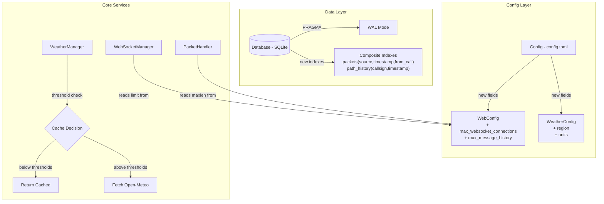
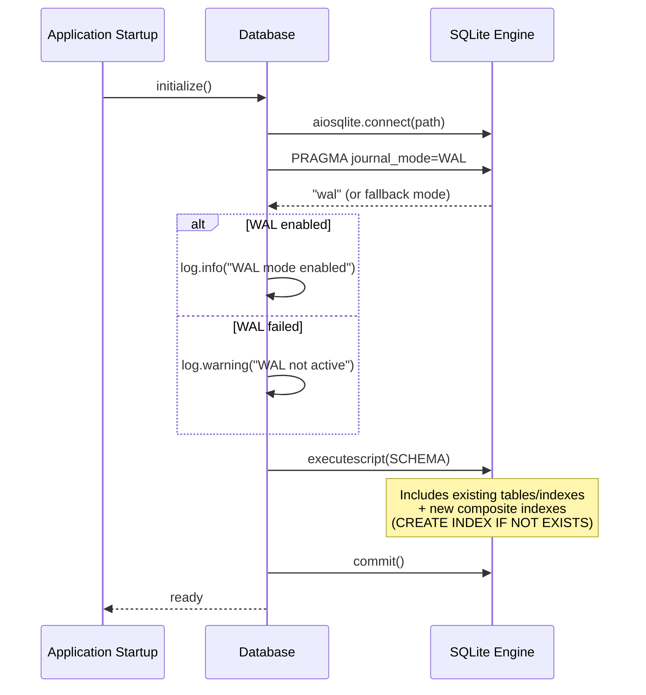
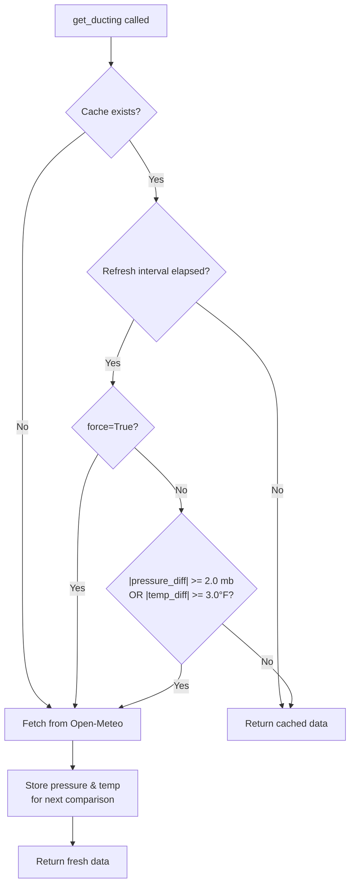

# Design Document: PropView v2 Upgrade

## Overview

This design covers targeted, backward-compatible improvements to APRS PropView's performance and configurability. The upgrade spans two areas:

1. **Codebase Optimizations** — SQLite WAL mode, threshold-based ducting cache invalidation, composite database indexes, and configurable limits for WebSocket connections and message history.
2. **Backward Compatibility** — Existing `config.toml` files work without modification; new fields use sensible defaults and are written on the next save. Database optimizations apply automatically on startup.

All changes are additive — no breaking changes to existing API endpoints, response formats, or frontend behavior.

## Architecture

### High-Level Change Map



### Database Initialization Flow



### Ducting Cache Threshold Decision Flow



## Components and Interfaces

### 1. Database WAL Mode (`server/database.py`)

The `Database.initialize()` method is updated to execute `PRAGMA journal_mode=WAL` immediately after opening the connection, before running the schema script. This allows concurrent readers (analytics queries) and a single writer (packet logging) without blocking each other.

```python
async def initialize(self):
    """Create database and tables with WAL mode."""
    self.db = await aiosqlite.connect(self.db_path)
    self.db.row_factory = aiosqlite.Row

    # Enable WAL mode before any other operations
    try:
        result = await self.db.execute("PRAGMA journal_mode=WAL")
        row = await result.fetchone()
        journal_mode = row[0] if row else "unknown"
        if journal_mode.lower() == "wal":
            logger.info(f"Database WAL mode enabled (journal_mode={journal_mode})")
        else:
            logger.warning(
                f"Database journal mode is '{journal_mode}', WAL not active"
            )
    except Exception as e:
        logger.warning(f"Failed to set WAL mode: {e}")

    await self.db.executescript(SCHEMA)
    await self.db.commit()
    logger.info(f"Database initialized at {self.db_path}")
```

**Design decision**: WAL mode is unconditional — no config flag. It's a strict improvement for PropView's read-heavy/write-light workload. The fallback path (warning + continue) ensures the application still works on filesystems that don't support WAL (e.g., some network mounts).

### 2. Composite Database Indexes (`server/database.py`)

Two new composite indexes are appended to the existing `SCHEMA` string:

```sql
-- Composite indexes for analytics query performance
CREATE INDEX IF NOT EXISTS idx_packets_source_timestamp_from
    ON packets(source, timestamp, from_call);

CREATE INDEX IF NOT EXISTS idx_path_history_callsign_timestamp
    ON path_history(callsign, timestamp);
```

These indexes target the most expensive analytics queries in `AnalyticsEngine`:
- `idx_packets_source_timestamp_from` covers the heatmap join query that filters `packets` by `source` and `timestamp`, then joins on `from_call`.
- `idx_path_history_callsign_timestamp` covers `get_path_history()` and `get_all_path_history()` which filter on `callsign` and `timestamp`.

**Design decision**: Using `CREATE INDEX IF NOT EXISTS` ensures idempotent execution on existing databases. All existing single-column indexes are preserved — the new composite indexes supplement rather than replace them.

### 3. Threshold-Based Ducting Cache (`server/weather.py`)

The `WeatherManager.get_ducting()` method is extended with threshold-based cache invalidation. Two new instance variables track the previous readings:

```python
class WeatherManager:
    def __init__(self, config: Config):
        # ... existing fields ...
        self._last_ducting_pressure: Optional[float] = None
        self._last_ducting_temp: Optional[float] = None
```

The threshold decision logic (extracted as a pure function for testability):

```python
def _should_refetch_ducting(
    prev_pressure: Optional[float],
    curr_pressure: Optional[float],
    prev_temp: Optional[float],
    curr_temp: Optional[float],
) -> bool:
    """Return True if atmospheric conditions changed enough to warrant a refetch.

    Thresholds: pressure change >= 2.0 mb OR temperature change >= 3.0°F.
    Returns True (fetch) if no previous data exists.
    """
    if prev_pressure is None or prev_temp is None:
        return True
    if curr_pressure is None or curr_temp is None:
        return True
    return abs(curr_pressure - prev_pressure) >= 2.0 or abs(curr_temp - prev_temp) >= 3.0
```

The updated `get_ducting()` method:

```python
async def get_ducting(self, force: bool = False) -> Optional[Dict[str, Any]]:
    if not self.is_configured or not self._location:
        return None

    # Check time-based cache first
    if not force and self._ducting and (time.time() - self._last_ducting_fetch < 900):
        return self._ducting

    # Time has elapsed — now check thresholds
    if not force and self._ducting:
        current_weather = await self.get_current_weather()
        curr_pressure = current_weather.get("pressure_mb") if current_weather else None
        curr_temp = current_weather.get("temperature_f") if current_weather else None

        if not _should_refetch_ducting(
            self._last_ducting_pressure, curr_pressure,
            self._last_ducting_temp, curr_temp,
        ):
            # Below thresholds — return cached, reset timer
            self._last_ducting_fetch = time.time()
            return self._ducting

    # Fetch fresh data
    ducting = await fetch_ducting_data(
        self._location["latitude"],
        self._location["longitude"],
    )
    if ducting:
        self._ducting = ducting
        self._last_ducting_fetch = time.time()
        self._last_ducting_pressure = ducting.get("pressure_mb")
        self._last_ducting_temp = ducting.get("surface_temp_f")

    return self._ducting
```

**Design decision**: The threshold values (2.0 mb pressure, 3.0°F temperature) are hardcoded rather than configurable. These are atmospheric significance thresholds — changes below these magnitudes don't meaningfully affect the ducting index calculation. Making them configurable would add complexity without benefit.

### 4. Configurable WebSocket Connection Limit (`server/websocket_manager.py`, `server/config.py`)

The `WebConfig` dataclass gains a new field:

```python
@dataclass
class WebConfig:
    # ... existing fields ...
    max_websocket_connections: int = 20
```

The `WebSocketManager` is updated to accept the limit at initialization instead of using a class constant:

```python
class WebSocketManager:
    def __init__(self, max_connections: int = 20):
        self.max_connections = max_connections
        self.active_connections: Set[WebSocket] = set()
        self._message_queue: asyncio.Queue = asyncio.Queue()

    async def connect(self, websocket: WebSocket) -> bool:
        if len(self.active_connections) >= self.max_connections:
            await websocket.close(code=1013, reason="Too many connections")
            logger.warning(
                f"WebSocket rejected: at {self.max_connections} connection limit"
            )
            return False
        await websocket.accept()
        self.active_connections.add(websocket)
        logger.info(f"WebSocket client connected ({len(self.active_connections)} total)")
        return True
```

The `MAX_CONNECTIONS` class constant is removed. The application startup code passes `config.web.max_websocket_connections` to the constructor.

### 5. Configurable Message History Limit (`server/packet_handler.py`, `server/config.py`)

The `WebConfig` dataclass gains another field:

```python
@dataclass
class WebConfig:
    # ... existing fields ...
    max_message_history: int = 500
```

The `PacketHandler` reads the limit from config instead of the module-level `MAX_MESSAGE_HISTORY` constant:

```python
class PacketHandler:
    def __init__(self, config: Config, tracker, digipeater, igate, ws_manager):
        # ... existing init ...
        max_history = config.web.max_message_history
        self._messages: deque = deque(maxlen=max_history)
```

The module-level `MAX_MESSAGE_HISTORY = 500` constant is removed.

### 6. Config Persistence and Migration (`server/config.py`)

The `Config.load()` method already handles missing fields gracefully — Python dataclass defaults fill in any fields absent from the TOML. The `Config.save()` method is updated to write the new fields:

In the `[web]` section of `save()`:
```python
f"max_websocket_connections = {int(self.web.max_websocket_connections)}",
f"max_message_history = {int(self.web.max_message_history)}",
```

In the `[weather]` section of `save()`:
```python
f'region = "{esc(self.weather.region)}"',
f'units = "{esc(self.weather.units)}"',
```

The `DEFAULT_CONFIG` template is updated with commented examples for all new fields:

```toml
[web]
# ... existing fields ...
# max_websocket_connections = 20   # Maximum simultaneous WebSocket connections (1-100)
# max_message_history = 500        # Maximum APRS messages kept in memory (100-10000)

[weather]
# ... existing fields ...
# region = "auto"                  # Region: "auto", "US", "UK", "EU"
# units = "imperial"               # Units: "imperial", "metric"
```

**Design decision**: New fields use commented-out examples in the default template rather than active values. This keeps the default config minimal while showing operators what's available. The dataclass defaults ensure correct behavior when fields are absent.

## Data Models

### Config Dataclass Changes

```python
@dataclass
class WebConfig:
    host: str = "127.0.0.1"
    port: int = 14501
    font_family: str = ""
    ghost_after_minutes: int = 60
    expire_after_minutes: int = 0
    mobile_pin: str = ""
    update_check_enabled: bool = True
    update_check_interval_hours: int = 24
    max_websocket_connections: int = 20    # NEW
    max_message_history: int = 500         # NEW

@dataclass
class WeatherConfig:
    # ... existing fields ...
    region: str = "auto"       # NEW — "auto", "US", "UK", "EU"
    units: str = "imperial"    # NEW — "imperial", "metric"
```

### Database Schema Changes

No new tables. Two new composite indexes appended to the `SCHEMA` constant:

```sql
CREATE INDEX IF NOT EXISTS idx_packets_source_timestamp_from
    ON packets(source, timestamp, from_call);

CREATE INDEX IF NOT EXISTS idx_path_history_callsign_timestamp
    ON path_history(callsign, timestamp);
```

WAL mode enabled via pragma at connection time (not part of the schema string — executed separately before `executescript`).

### WeatherManager State Changes

```python
class WeatherManager:
    # NEW instance variables for threshold tracking
    _last_ducting_pressure: Optional[float] = None   # mb from last successful fetch
    _last_ducting_temp: Optional[float] = None        # °F from last successful fetch
```

These are transient in-memory state — not persisted. They reset to `None` on application restart, which correctly triggers a fresh fetch on the first ducting request.


## Correctness Properties

*A property is a characteristic or behavior that should hold true across all valid executions of a system — essentially, a formal statement about what the system should do. Properties serve as the bridge between human-readable specifications and machine-verifiable correctness guarantees.*

### Property 1: Ducting cache threshold decision is correct

*For any* previous pressure `p1` in [950, 1060] mb, current pressure `p2` in [950, 1060] mb, previous temperature `t1` in [-40, 130] °F, and current temperature `t2` in [-40, 130] °F, the ducting cache SHALL return cached data (skip API fetch) if and only if `|p2 - p1| < 2.0` AND `|t2 - t1| < 3.0`. If either threshold is met or exceeded, a fresh fetch SHALL be triggered.

**Validates: Requirements 2.1, 2.2, 2.3**

### Property 2: WebSocket connection limit enforcement

*For any* configured `max_websocket_connections` value N (where 1 ≤ N ≤ 100), the WebSocketManager SHALL accept the first N connection attempts and reject the (N+1)th connection attempt with close code 1013.

**Validates: Requirements 4.2**

### Property 3: Message history deque respects configured maxlen

*For any* configured `max_message_history` value M (where 1 ≤ M ≤ 10000), after inserting M+K messages into the PacketHandler message deque, the deque length SHALL be exactly M and the oldest K messages SHALL have been evicted.

**Validates: Requirements 5.2**

### Property 4: Config save/load round-trip preserves new fields

*For any* valid Config object containing the new fields (`region` in {"auto", "US", "UK", "EU"}, `units` in {"imperial", "metric"}, `max_websocket_connections` in [1, 100], `max_message_history` in [1, 10000]), saving to TOML and loading back SHALL produce a Config object with identical field values for all new and existing fields.

**Validates: Requirements 6.5**

## Error Handling

### Database

| Scenario | Behavior |
|---|---|
| WAL pragma fails (e.g., network filesystem) | Log warning with the actual journal mode, continue with default mode. Application remains fully functional. (Req 1.3) |
| WAL pragma returns unexpected mode | Log warning showing the returned mode string. No retry — the default mode is acceptable. |
| Index creation on existing DB | `CREATE INDEX IF NOT EXISTS` ensures idempotent execution — no error on re-run. (Req 3.3) |
| Corrupt database file | `aiosqlite.connect` raises `OperationalError`. Existing error handling in `app.py` catches this at startup. |

### Weather / Ducting Cache

| Scenario | Behavior |
|---|---|
| No previous ducting data in cache | Fetch fresh data unconditionally (threshold check skipped). (Req 2.5) |
| Current weather unavailable for threshold check | Treat as "no previous data" — fetch fresh ducting data. |
| Open-Meteo API failure during ducting fetch | Return previously cached data if available, `None` otherwise. Log warning. |
| `force=True` parameter | Bypass both time-based cache and threshold checks. Always fetch. (Req 2.4) |

### Configuration Migration

| Scenario | Behavior |
|---|---|
| Missing `region` field in config.toml | Default to `"auto"`. (Req 6.1) |
| Missing `units` field in config.toml | Default to `"imperial"`. (Req 6.2) |
| Missing `max_websocket_connections` | Default to 20. (Req 6.3) |
| Missing `max_message_history` | Default to 500. (Req 6.4) |
| Existing US ZIP `location_code` | Continue resolving via Zippopotam API — no change to geocoding logic. (Req 6.6) |

### WebSocket Connection Limit

| Scenario | Behavior |
|---|---|
| Connection attempt at capacity | Reject with close code 1013 ("Try Again Later") and log warning. (Req 4.2) |
| Connection limit not in config | Use default of 20. (Req 4.3) |

### Message History Limit

| Scenario | Behavior |
|---|---|
| Messages exceed configured limit | Python `deque(maxlen=M)` automatically evicts oldest entries. No explicit error handling needed. |
| Message history limit not in config | Use default of 500. (Req 5.3) |

## Testing Strategy

### Test Framework and Dependencies

- **Unit/Property tests**: `pytest` + `pytest-asyncio` + `hypothesis` (property-based testing)
- **Existing tests**: The project already has `tests/test_ducting_cache.py` with Hypothesis property tests — this pattern is continued for new properties.

### Dual Testing Approach

**Unit tests** cover specific examples, edge cases, and integration points:
- WAL mode activation and logging (Req 1.1, 1.2, 1.3)
- Composite index existence after initialization (Req 3.1, 3.2)
- Idempotent index creation on re-initialization (Req 3.3)
- Existing index preservation (Req 3.4)
- Default config values for new fields (Req 4.1, 4.3, 5.1, 5.3)
- Config reading from TOML for new fields (Req 4.4, 5.4)
- Force refresh bypasses threshold (Req 2.4)
- Empty cache triggers fetch (Req 2.5)
- Pressure/temperature storage after fetch (Req 2.6)
- Backward compatibility with existing config files (Req 6.1–6.4, 6.6–6.9)
- Default config template includes new field examples (Req 6.7)

**Property-based tests** verify universal properties across randomized inputs using Hypothesis:
- Ducting threshold decision correctness (Property 1)
- WebSocket connection limit enforcement (Property 2)
- Message history deque maxlen enforcement (Property 3)
- Config save/load round-trip (Property 4)

### Property Test Configuration

- **Library**: [Hypothesis](https://hypothesis.readthedocs.io/) for Python
- **Minimum iterations**: 100 per property (Hypothesis `@settings(max_examples=100)` minimum; existing tests use 200-300)
- **Tag format**: Each test tagged with `# Feature: propview-v2-upgrade, Property N: <title>`
- **One test per property**: Each of the 4 correctness properties maps to one or more Hypothesis test functions (the ducting threshold property uses 3 complementary test functions as in the existing `test_ducting_cache.py`)

### Test File Mapping

| Test File | Properties / Requirements |
|---|---|
| `tests/test_ducting_cache.py` | Property 1 (Req 2.1, 2.2, 2.3) — **already exists** |
| `tests/test_websocket_manager.py` | Property 2 (Req 4.2, 4.3, 4.4) |
| `tests/test_packet_handler.py` | Property 3 (Req 5.2, 5.3, 5.4) — extend existing file |
| `tests/test_config.py` | Property 4 (Req 6.5) + unit tests for defaults (Req 6.1–6.4, 6.7) |
| `tests/test_database.py` | Unit tests for WAL mode (Req 1.1–1.4) and indexes (Req 3.1–3.4) |
