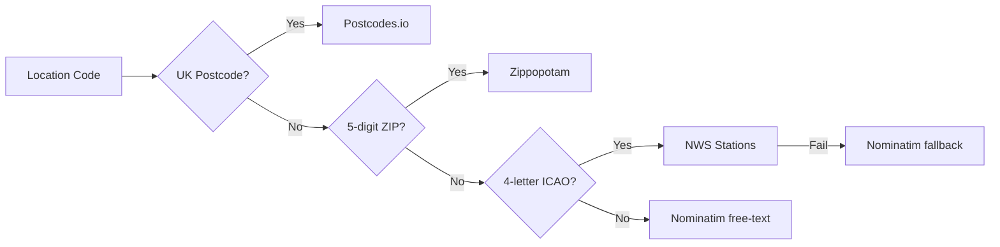

# Design Document: UK/EU Internationalization

## Overview

This design documents the UK/EU internationalization feature for APRS PropView. The feature extends the weather subsystem — originally US-only — to support stations in the United Kingdom and continental Europe. It is organized around five core concerns:

1. **Region detection** — Classify station coordinates into US, UK, or EU using bounding-box geometry, with manual override support.
2. **Unit system management** — Provide imperial and metric display units as immutable dataclass configurations, with region-aware auto-selection and Open-Meteo API parameter generation.
3. **Multi-format geocoding** — Resolve user-entered location codes through a priority chain: UK postcode → US ZIP → ICAO code (NWS + Nominatim fallback) → Nominatim free-text.
4. **Regional alert providers** — Fetch severe weather alerts from NWS (US) or Meteoalarm CAP/Atom feeds (UK/EU) through a common abstract interface, with CAP XML parsing and polygon-to-GeoJSON conversion.
5. **Unit-invariant ducting** — Ensure the VHF tropospheric ducting index always uses internal Fahrenheit/mb units regardless of display configuration, with threshold-based cache invalidation.
6. **Region-aware frontend labels** — Adapt UI input placeholders and unit suffixes based on the detected region and the `unit_labels` dictionary from weather API responses.

The implementation adds four new modules (`server/region.py`, `server/units.py`, `server/alert_providers.py`, and frontend label logic in `static/js/weather.js`) and extends two existing modules (`server/weather.py` for geocoding and WeatherManager integration, `server/config.py` for region/units configuration fields).

## Architecture

The internationalization feature follows a layered architecture where configuration drives region detection, which in turn selects the unit system, geocoding strategy, and alert provider.

```mermaid
graph TD
    A[config.toml] -->|weather.region, weather.units| B[WeatherConfig]
    B --> C[WeatherManager]
    C -->|station lat/lon + configured region| D[Region Detector]
    D -->|"US" / "UK" / "EU"| C

    C -->|effective_units| E[Unit System]
    E -->|unit_params| F[Open-Meteo API]
    E -->|format_weather_response| G[Weather Response]
    G -->|unit_labels + region| H[Frontend Label Logic]

    C -->|region| I[Alert Factory]
    I -->|"US"| J[NWSAlertProvider]
    I -->|"UK" / "EU"| K[MeteoalarmAlertProvider]
    K -->|CAP XML| L[CAP Parser]
    L -->|parse_cap_polygon| M[GeoJSON Polygon]

    C -->|location_code| N[Geocoding Chain]
    N -->|UK postcode pattern| O[Postcodes.io]
    N -->|5-digit ZIP| P[Zippopotam]
    N -->|4-letter ICAO| Q[NWS Stations]
    Q -->|Fail| R[Nominatim fallback]
    N -->|free text| S[Nominatim]

    C -->|always Fahrenheit/mb| T[Ducting Calculator]
    T -->|threshold check| U[Ducting Cache]
```

### Key Design Decisions

1. **Bounding-box geometry over geocoding APIs for region detection.** Bounding boxes are fast, offline, and deterministic. The check order (US → UK → EU) ensures the UK — a geographic subset of the broad EU box — is classified correctly. Coordinates outside all boxes default to "US" for backward compatibility.

2. **Immutable frozen dataclass for UnitSystem.** Using `@dataclass(frozen=True)` prevents accidental mutation and makes the two singleton constants (`IMPERIAL`, `METRIC`) safe to share across the application.

3. **Abstract base class for alert providers.** `AlertProvider` defines a single `fetch_alerts(lat, lon, **kwargs)` interface. The factory function `get_alert_provider(region)` returns the correct implementation, keeping the WeatherManager region-agnostic.

4. **Regex-based format detection for geocoding.** The resolution chain uses compiled regexes (`_UK_POSTCODE_RE`, `_ZIP_RE`, `_ICAO_RE`) to classify input format before dispatching to the appropriate resolver. The chain does not fall through — if a matched resolver returns None, the result is None.

5. **ICAO resolution with Nominatim fallback.** The ICAO resolver tries the NWS stations API first (which covers US stations well), then falls back to Nominatim with a `"{ICAO} airport"` query for non-US codes like EGLL or LFPG.

6. **Ducting always fetches in Fahrenheit/mb.** The `fetch_ducting_data()` function hardcodes `&temperature_unit=fahrenheit&wind_speed_unit=mph` in its Open-Meteo request, making the scoring algorithm unit-invariant regardless of display configuration.

7. **Threshold-based ducting cache.** Rather than refetching on a fixed timer, the ducting cache compares current atmospheric readings against the previous fetch. If pressure Δ < 2.0 mb AND temp Δ < 3.0°F, the cached value is reused, minimizing API calls without sacrificing accuracy.

8. **Region-aware frontend labels.** The frontend reads the `region` and `unit_labels` fields from weather API responses to dynamically update input placeholders and unit suffixes, avoiding hardcoded US-centric text.

## Components and Interfaces

### 1. Region Detector (`server/region.py`)

**Purpose:** Classify station coordinates into one of three operating regions.

**Public API:**

| Function | Signature | Returns |
|---|---|---|
| `detect_region` | `(lat: float, lon: float) -> str` | `"US"`, `"UK"`, or `"EU"` |
| `get_effective_region` | `(lat: float, lon: float, configured_region: str = "auto") -> str` | `"US"`, `"UK"`, or `"EU"` |

**Internal constants:**
- `_US_BOXES`: List of 6 US territory bounding boxes (CONUS, Alaska, Hawaii, PRVI, Guam, Samoa)
- `_UK_BOX`: `(49.9, 60.9, -8.2, 1.8)`
- `_EU_BOX`: `(34.0, 71.0, -25.0, 45.0)`
- `VALID_REGIONS`: `{"auto", "US", "UK", "EU"}`

**Behavior:**
- `detect_region` checks US boxes first, then UK, then EU. Coordinates outside all boxes default to `"US"`.
- `get_effective_region` returns the manual override if it's `"US"`, `"UK"`, or `"EU"`. If the configured region is `"auto"`, empty, or unrecognized, it delegates to `detect_region`.

### 2. Unit System (`server/units.py`)

**Purpose:** Define imperial and metric display units and format weather API responses.

**Public API:**

| Symbol | Type | Description |
|---|---|---|
| `UnitSystem` | `@dataclass(frozen=True)` | Immutable unit configuration with API params, display labels, and field name suffixes |
| `IMPERIAL` | `UnitSystem` | Fahrenheit, mph, inches, miles |
| `METRIC` | `UnitSystem` | Celsius, km/h, mm, km |
| `get_unit_system(units: str)` | Function | Returns `METRIC` for `"metric"`, `IMPERIAL` otherwise |
| `open_meteo_unit_params(unit_system)` | Function | Returns URL query string for Open-Meteo API |
| `format_weather_response(raw, unit_system)` | Function | Adds unit-labeled fields and `unit_labels` dict to response |

**UnitSystem fields:**
- API parameters: `temperature_unit`, `wind_speed_unit`, `precipitation_unit`
- Display labels: `temp_label`, `wind_label`, `precip_label`, `distance_label`
- Response field suffixes: `temp_field`, `wind_field`, `precip_field`

### 3. Alert Providers (`server/alert_providers.py`)

**Purpose:** Provide a unified interface for fetching severe weather alerts from regional APIs.

**Public API:**

| Symbol | Type | Description |
|---|---|---|
| `AlertProvider` | ABC | Abstract base with `fetch_alerts(lat, lon, **kwargs)` |
| `NWSAlertProvider` | Class | US alerts from api.weather.gov |
| `MeteoalarmAlertProvider` | Class | UK/EU alerts from Meteoalarm Atom/CAP feeds |
| `get_alert_provider(region)` | Factory | Returns `NWSAlertProvider` for `"US"`, `MeteoalarmAlertProvider` for `"UK"`/`"EU"` |
| `parse_cap_alert(info_element)` | Function | Parse a CAP `<info>` XML element into a normalized alert dict |
| `parse_cap_polygon(polygon_text)` | Function | Convert CAP polygon string to GeoJSON Polygon geometry |
| `map_meteoalarm_severity(awareness_level)` | Function | Map Meteoalarm severity to `"warning"` or `"watch"` |
| `classify_alert_categories(event, alert_type)` | Function | Return coarse overlay categories for an alert |

**Severity mapping:**
- `"Extreme"` / `"Severe"` → `"warning"`
- `"Moderate"` / `"Minor"` → `"watch"`
- Unknown / unrecognized → `"watch"` (default)

**CAP polygon conversion:**
- CAP format: `"lat1,lon1 lat2,lon2 ..."` → GeoJSON: `{"type": "Polygon", "coordinates": [[[lon1,lat1], ...]]}`
- Ring is closed per GeoJSON spec. Already-closed rings are not duplicated.
- Returns `None` for empty input, whitespace-only, None, or fewer than 3 valid points.

**Alert sorting:**
- Returned alerts are sorted with warnings before watches.

### 4. Geocoding Chain (`server/weather.py`)

**Purpose:** Resolve user-entered location codes to lat/lon/name through format-specific resolvers.

**Resolution order:**



**Format detection regexes:**
- `_UK_POSTCODE_RE`: `r"^[A-Z]{1,2}\d[A-Z\d]?\s*\d[A-Z]{2}$"` (case-insensitive)
- `_ZIP_RE`: `r"^\d{5}$"`
- `_ICAO_RE`: `r"^[A-Z]{4}$"` (input uppercased before matching)

**Key behaviors:**
- UK postcode resolver normalizes by stripping spaces and uppercasing before calling Postcodes.io.
- UK postcodes are accepted in all standard formats: A9 9AA, A99 9AA, A9A 9AA, AA9 9AA, AA99 9AA, AA9A 9AA — with or without a space, in any letter case.
- ICAO resolver tries NWS first, falls back to Nominatim with `"{ICAO} airport"` query for non-US codes.
- ICAO codes are normalized to uppercase before resolution.
- Nominatim enforces 1-second rate limiting between consecutive requests and includes a `"APRSPropView/1.0"` User-Agent header.
- Nominatim truncates display names longer than 80 characters to 77 + `"..."`.
- The chain does **not** fall through: if the matched resolver returns None, the overall result is None.

### 5. WeatherManager Integration (`server/weather.py`)

**Purpose:** Orchestrate weather data fetching with region-aware unit selection, alert provider routing, and ducting cache management.

**Key properties:**
- `effective_region`: Delegates to `get_effective_region(lat, lon, config.weather.region)`
- `effective_units`: Returns explicit config if set to `"imperial"` or `"metric"`, otherwise auto-selects metric for UK/EU and imperial for US

**Weather fetch flow:**
1. Resolve location code via `resolve_location()`
2. Determine `effective_units` → get `UnitSystem` → generate `unit_params`
3. Fetch from Open-Meteo with unit-appropriate parameters
4. Apply `format_weather_response()` to add `unit_labels` and named fields
5. Include `region` in the response payload for frontend label adaptation
6. Cache invalidation on unit system change

**Alert fetch flow:**
1. Determine `effective_region`
2. Call `get_alert_provider(region)` to get the correct provider
3. Delegate to `provider.fetch_alerts(lat, lon, ...)`
4. Meteoalarm provider determines country feed URL from station coordinates via bounding-box mapping

**Ducting fetch flow:**
1. Always uses hardcoded Fahrenheit/mph parameters (unit-invariant)
2. Threshold-based cache: skip refetch if pressure Δ < 2.0 mb AND temp Δ < 3.0°F
3. Refetch if either threshold is met or exceeded
4. Store pressure and temperature values from each fetch for comparison on the next cache check

### 6. Configuration (`server/config.py`)

**WeatherConfig fields added for internationalization:**

| Field | Type | Default | Description |
|---|---|---|---|
| `region` | `str` | `"auto"` | `"auto"`, `"US"`, `"UK"`, or `"EU"` |
| `units` | `str` | `"imperial"` | `"imperial"` or `"metric"` |

These fields are read from the `[weather]` section of `config.toml` and exposed through the `WeatherConfig` dataclass.

### 7. Frontend Label Logic (`static/js/weather.js`)

**Purpose:** Adapt UI input placeholders and unit suffixes based on the detected region and unit labels from the weather API response.

**Key behaviors:**
- When the detected region is "US" or unset, the location input placeholder references US ZIP codes and ICAO codes.
- When the detected region is "UK" or "EU", the location input placeholder references UK postcodes, ICAO codes, and place names.
- When a weather API response includes a `region` value, the frontend calls a label update function to adapt UI text.
- The frontend uses the `unit_labels` dictionary from weather API responses to display correct unit suffixes for temperature, wind speed, and precipitation values.

## Data Models

### UnitSystem (frozen dataclass)

```python
@dataclass(frozen=True)
class UnitSystem:
    temperature_unit: str       # "fahrenheit" or "celsius"
    wind_speed_unit: str        # "mph" or "kmh"
    precipitation_unit: str     # "inch" or "mm"
    temp_label: str             # "°F" or "°C"
    wind_label: str             # "mph" or "km/h"
    precip_label: str           # "in" or "mm"
    distance_label: str         # "miles" or "km"
    temp_field: str             # "temperature_f" or "temperature_c"
    wind_field: str             # "wind_speed_mph" or "wind_speed_kmh"
    precip_field: str           # "precipitation_in" or "precipitation_mm"
```

### Normalized Alert Dict

Both NWS and Meteoalarm alerts are normalized to this structure:

```python
{
    "id": str,
    "event": str,
    "severity": str,
    "alert_type": str,          # "warning" or "watch"
    "certainty": str,
    "urgency": str,
    "headline": str,
    "description": str,         # truncated to 6000 chars
    "instruction": str,         # truncated to 3000 chars
    "sender": str,
    "effective": str,
    "expires": str,
    "area_desc": str,
    "geometry": Optional[Dict],  # GeoJSON Polygon or None
    "overlay_categories": List[str],
}
```

### GeoJSON Polygon (from CAP)

```python
{
    "type": "Polygon",
    "coordinates": [
        [[lon1, lat1], [lon2, lat2], ..., [lon1, lat1]]  # closed ring
    ]
}
```

### Weather Response (after unit formatting)

The `format_weather_response()` function adds these fields to the raw Open-Meteo response:

- **Primary unit fields**: `temperature_c`/`temperature_f`, `wind_speed_kmh`/`wind_speed_mph`, `precipitation_mm`/`precipitation_in` (based on active unit system)
- **Backward-compatible imperial fields**: Always present regardless of unit system
- **`unit_labels` dict**: `{"temperature": "°C", "wind_speed": "km/h", "precipitation": "mm", "distance": "km"}` (or imperial equivalents)
- **`region`**: The effective region string (`"US"`, `"UK"`, or `"EU"`) for frontend label adaptation

### Bounding Box Tuple

```python
Tuple[float, float, float, float]  # (min_lat, max_lat, min_lon, max_lon)
```

### Ducting Cache State

```python
{
    "prev_pressure": Optional[float],   # mb from last fetch
    "prev_temp": Optional[float],       # °F from last fetch
}
```

## Correctness Properties

*A property is a characteristic or behavior that should hold true across all valid executions of a system — essentially, a formal statement about what the system should do. Properties serve as the bridge between human-readable specifications and machine-verifiable correctness guarantees.*

### Property 1: Region detection always returns a valid region

*For any* latitude in [-90, 90] and longitude in [-180, 180], `detect_region(lat, lon)` SHALL return exactly one of `"US"`, `"UK"`, or `"EU"`.

**Validates: Requirements 1.1, 1.5**

### Property 2: Coordinates inside a region's bounding box classify to that region

*For any* coordinate pair inside a US bounding box, `detect_region()` SHALL return `"US"`. *For any* coordinate pair inside the UK bounding box (and not inside any US box), `detect_region()` SHALL return `"UK"`. *For any* coordinate pair inside the EU bounding box (and not inside any US or UK box), `detect_region()` SHALL return `"EU"`.

**Validates: Requirements 1.2, 1.3, 1.4, 1.6**

### Property 3: Manual region override supersedes auto-detection

*For any* latitude, longitude, and manual region in `{"US", "UK", "EU"}`, `get_effective_region(lat, lon, manual)` SHALL return the manual region value regardless of coordinates.

**Validates: Requirements 2.1**

### Property 4: Auto-detection passthrough

*For any* latitude and longitude, `get_effective_region(lat, lon, "auto")` SHALL return the same value as `detect_region(lat, lon)`.

**Validates: Requirements 2.2**

### Property 5: Formatted weather response always includes complete unit labels

*For any* raw weather data dict and *for any* unit system (imperial or metric), `format_weather_response(raw, unit_system)` SHALL include a `unit_labels` dictionary containing keys `"temperature"`, `"wind_speed"`, `"precipitation"`, and `"distance"`.

**Validates: Requirements 5.1, 5.2**

### Property 6: Unit labels match the active unit system

*For any* raw weather data formatted with the imperial unit system, the `unit_labels` SHALL contain `"°F"`, `"mph"`, `"in"`, `"miles"`. *For any* raw weather data formatted with the metric unit system, the `unit_labels` SHALL contain `"°C"`, `"km/h"`, `"mm"`, `"km"`.

**Validates: Requirements 5.3, 5.4**

### Property 7: Metric response includes both metric and backward-compatible fields

*For any* raw weather data formatted with the metric unit system, the response SHALL include metric-named fields (`temperature_c`, `wind_speed_kmh`, `precipitation_mm`) AND backward-compatible imperial-named fields (`temperature_f`, `wind_speed_mph`, `precipitation_in`).

**Validates: Requirements 5.5**

### Property 8: UK postcode regex accepts all valid format variants

*For any* valid UK postcode outward code (A9, A99, A9A, AA9, AA99, AA9A) combined with *any* valid inward code (digit followed by two letters), the `_UK_POSTCODE_RE` regex SHALL match the postcode with a space, without a space, and in any letter case.

**Validates: Requirements 6.2, 6.3, 6.4**

### Property 9: ICAO regex accepts any four uppercase letters

*For any* string of exactly four uppercase ASCII letters, the `_ICAO_RE` regex SHALL match.

**Validates: Requirements 7.4**

### Property 10: Nominatim display name truncation

*For any* display name string longer than 80 characters, the Nominatim client SHALL truncate it to exactly 80 characters (77 characters followed by `"..."`). *For any* display name string of 80 characters or fewer, the string SHALL be returned unchanged.

**Validates: Requirements 8.6**

### Property 11: Meteoalarm severity mapping always returns warning or watch

*For any* input string, `map_meteoalarm_severity()` SHALL return either `"warning"` or `"watch"`. Specifically, `"Extreme"` and `"Severe"` SHALL map to `"warning"`; all other inputs SHALL map to `"watch"`.

**Validates: Requirements 11.2, 11.4, 11.5**

### Property 12: Valid CAP polygons produce closed GeoJSON with correct coordinate order

*For any* list of 3 or more valid latitude/longitude pairs, `parse_cap_polygon()` SHALL return a GeoJSON Polygon where: (a) coordinates are in [lon, lat] order, (b) the ring is closed (first point equals last point), and (c) each coordinate is a two-element list of floats. *For any* already-closed input ring, the closure SHALL be preserved without duplicating the closing point.

**Validates: Requirements 12.1, 12.2, 12.3, 12.4**

### Property 13: Ducting score is unit-invariant and bounded

*For any* set of atmospheric inputs (surface temperature, 850hPa temperature, pressure, pressure trend, humidity, wind speed), the ducting scoring algorithm SHALL produce identical results regardless of the configured display unit system, and the score SHALL be in the range [0, 100].

**Validates: Requirements 13.2, 13.3**

### Property 14: Below-threshold atmospheric changes do not trigger ducting refetch

*For any* pair of pressure readings with absolute difference < 2.0 mb AND *any* pair of temperature readings with absolute difference < 3.0°F, the threshold decision function SHALL return "do not refetch" (cached).

**Validates: Requirements 14.1**

### Property 15: Pressure threshold met triggers ducting refetch

*For any* pair of pressure readings with absolute difference ≥ 2.0 mb, the threshold decision function SHALL return "refetch" regardless of temperature difference.

**Validates: Requirements 14.2**

### Property 16: Temperature threshold met triggers ducting refetch

*For any* pair of temperature readings with absolute difference ≥ 3.0°F, the threshold decision function SHALL return "refetch" regardless of pressure difference.

**Validates: Requirements 14.3**

## Error Handling

### Region Detection
- **Unknown coordinates:** Coordinates outside all bounding boxes default to `"US"` — no error raised.
- **Invalid config region:** Empty string, `None`, or unrecognized `weather.region` values fall back to auto-detection silently.

### Unit System
- **Unknown unit string:** `get_unit_system()` defaults to `IMPERIAL` for any unrecognized input including `None` and empty string.

### Geocoding
- **Postcodes.io failure:** Returns `None` on HTTP error, non-200 status, or missing lat/lon in response.
- **NWS station lookup failure:** Falls back to Nominatim with `"{ICAO} airport"` query.
- **Nominatim failure:** Returns `None` on HTTP error or empty result set.
- **No resolver match:** If the matched resolver returns `None`, `resolve_location()` returns `None` — no fallthrough to the next resolver.
- **Rate limiting:** Nominatim requests are throttled to 1 per second via `_nominatim_last_request` timestamp tracking.

### Alert Providers
- **NWS fetch failure:** `NWSAlertProvider.fetch_alerts()` catches all exceptions and returns an empty list.
- **Meteoalarm feed failure:** `MeteoalarmAlertProvider.fetch_alerts()` catches all exceptions and returns an empty list.
- **CAP XML parse error:** `_parse_atom_feed()` catches `ET.ParseError` and returns an empty list.
- **Missing CAP event field:** `parse_cap_alert()` returns `None` for info elements without an event.
- **Invalid polygon data:** `parse_cap_polygon()` returns `None` for empty, whitespace-only, None, too-few-points, or malformed input.

### Ducting
- **API failure:** `fetch_ducting_data()` returns `None` if Open-Meteo is unreachable.
- **Missing atmospheric data:** Individual scoring factors are skipped when their input values are `None`.
- **Cache comparison with missing data:** If previous pressure/temp values are `None`, the threshold check is skipped and a fresh fetch is triggered.

### WeatherManager
- **Unit system change:** Cache is invalidated (`_last_fetch = 0`, `_current = None`) when `effective_units` changes between fetches.
- **Location code change:** All caches are reset when the configured location code differs from the last resolved code.

### Frontend
- **Missing region in response:** If the weather API response does not include a `region` value, the frontend retains the current placeholder text (defaults to US-centric).
- **Missing unit_labels:** If `unit_labels` is absent, the frontend falls back to hardcoded imperial suffixes for backward compatibility.

## Testing Strategy

### Property-Based Testing (Hypothesis)

The feature uses [Hypothesis](https://hypothesis.readthedocs.io/) for property-based testing. Each correctness property maps to one or more property-based test functions with a minimum of 100 iterations.

**Test files and property mapping:**

| Test File | Properties Covered | Min Iterations |
|---|---|---|
| `tests/test_region.py` | Properties 1, 2, 3, 4 | 100–500 |
| `tests/test_weather_units.py` | Properties 5, 6, 7 | 100–200 |
| `tests/test_geocoder.py` | Properties 8, 9, 10 | 100–300 |
| `tests/test_alert_providers.py` | Properties 11, 12 | 100–200 |
| `tests/test_ducting_invariance.py` | Property 13 | 200–300 |
| `tests/test_ducting_cache.py` | Properties 14, 15, 16 | 200–300 |

**Tag format:** Each test file includes a docstring header with:
```
Feature: uk-eu-internationalization, Property {number}: {property_text}
Validates: Requirements X.Y
```

**Property test configuration:**
- Library: Hypothesis (Python)
- Minimum iterations: 100 per property (most use 200–500)
- Settings: `@settings(max_examples=N)` decorator on each test
- Strategies: Custom strategies for coordinates-in-box, UK postcode components, atmospheric values, random alert lists

### Unit Tests (Example-Based)

Unit tests complement property tests by covering:

- **Known-location classification:** Parametrized tests with real city coordinates (New York, London, Paris, Tokyo, etc.)
- **Default-to-US for out-of-box coordinates:** Antarctica, central Pacific, etc.
- **Factory routing:** `get_alert_provider("US")` returns `NWSAlertProvider`, `"UK"`/`"EU"` returns `MeteoalarmAlertProvider`
- **CAP XML parsing:** Complete info element produces all required fields; missing event returns `None`
- **Boundary conditions:** Exact threshold values (2.0 mb, 3.0°F), zero change, both thresholds met
- **Format disambiguation:** UK postcode not confused with ICAO; ZIP not confused with UK postcode
- **get_unit_system defaults:** Empty, `None`, and unknown strings default to `IMPERIAL`
- **Open-Meteo parameter generation:** Imperial and metric params contain correct unit values
- **Auto-selection of units by region:** UK/EU → metric, US → imperial when no explicit override
- **Explicit units override:** `"imperial"` or `"metric"` config overrides region-based auto-selection
- **CAP polygon edge cases:** Empty, None, whitespace-only, fewer than 3 points all return None
- **Frontend placeholder text:** US region shows ZIP/ICAO hints; UK/EU shows postcode/ICAO/place name hints

### Integration Tests

Integration tests (requiring mocked HTTP) cover:

- **Geocoding chain routing:** UK postcode → Postcodes.io, ZIP → Zippopotam, ICAO → NWS + Nominatim fallback, free text → Nominatim
- **No fallthrough:** Matched resolver returning None produces overall None
- **Meteoalarm Atom feed fetching and CAP parsing end-to-end**
- **Meteoalarm country feed URL selection from coordinates**
- **NWS alert fetching and normalization**
- **WeatherManager cache invalidation on unit/location changes**
- **Nominatim rate limiting enforcement (1-second minimum interval)**
- **Nominatim User-Agent header inclusion**
- **Ducting API always requests Fahrenheit/mph regardless of display config**
- **Ducting cache stores pressure/temp values for threshold comparison**
- **Weather response includes region field for frontend consumption**

### Dual Testing Balance

- **Property tests** handle comprehensive input coverage (regex matching, severity mapping, coordinate classification, unit formatting, threshold decisions, polygon conversion, display name truncation)
- **Unit tests** handle specific examples, edge cases, and known-good values
- **Integration tests** handle external API interactions, routing logic, and end-to-end flows
- Avoid redundant unit tests where property tests already cover the input space
